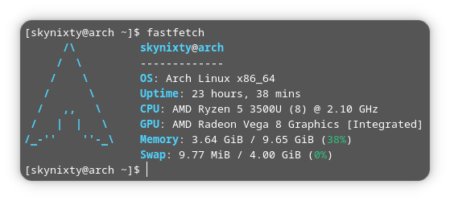

# short-fastfetch-config

A cleaner, minimal config for Fastfetch that keeps the “vanilla” feel.

## Preview

## License

This project is licensed under the MIT License.

Parts of this configuration are based on the Fastfetch project, which is also licensed under the MIT License.
See the original project: https://github.com/fastfetch-cli/fastfetch
