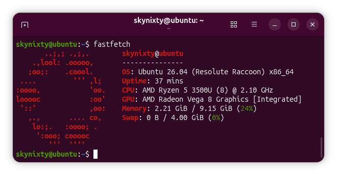

# short-fastfetch-config

A clean, minimal config for fastfetch that keeps the vanilla feel.

See the configuration file here: [config.jsonc](config.jsonc)

This repo is still not finished!
TODO: 
[ ] Add terminal name to the preview 
[ ] Add more major distro previews

## Preview

<p float="left">
  
  
</p>

## Install script

Use this if you don’t want to do it manually:

```bash
mkdir -p ~/.config/fastfetch \
&& curl -L -o ~/.config/fastfetch/config.jsonc \
https://raw.githubusercontent.com/SkyNixty/short-fastfetch-config/main/config.jsonc
```

## License

This project is licensed under the MIT License.

Parts of this configuration are based on the Fastfetch project, which is also licensed under the MIT License.  
See the original project: https://github.com/fastfetch-cli/fastfetch
